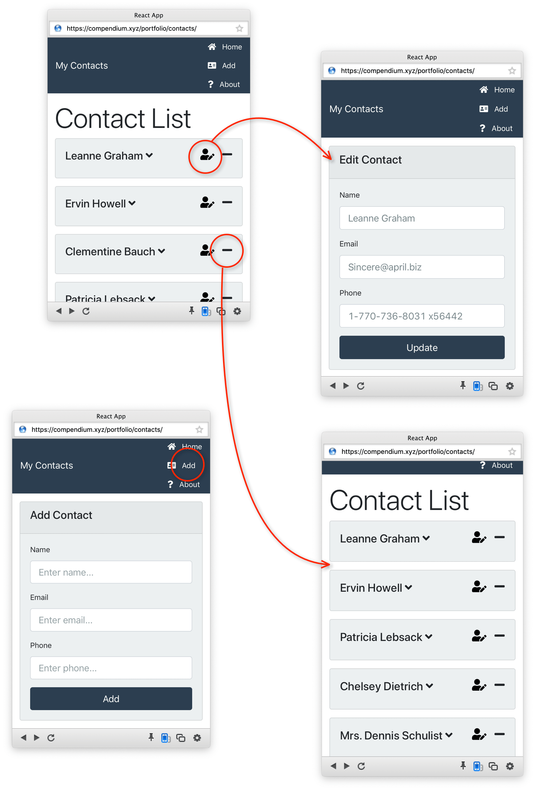

A ReactJS app that stores contact list consisting of name, email, and phone number. For this implementation, it uses JSON placeholder API service from https://jsonplaceholder.typicode.com/ to populate the app with entries.

https://compendium.xyz/portfolio/contacts/

**Keywords**

ReactJS: Context API & Provider state, controlled components, uncontrolled components,
Bootstrap 4, 
FontAwesome,
